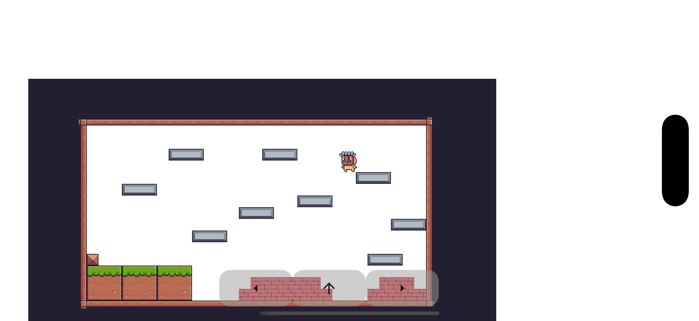
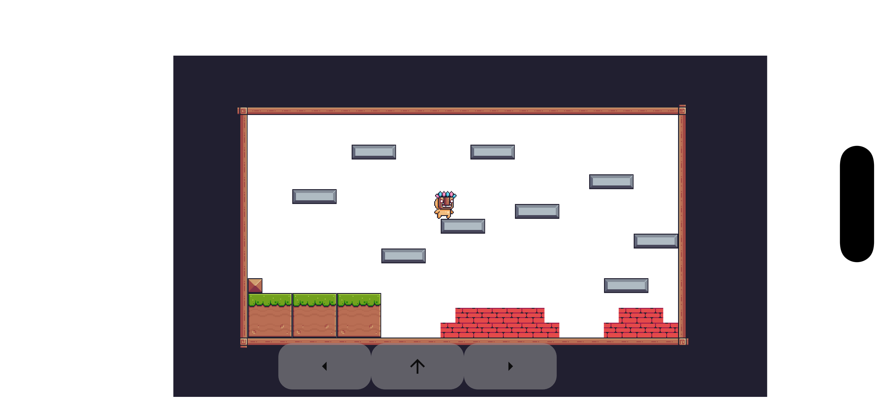

# 🔥 Pixel Blaze — A Flutter Pixel Art Adventure


**Pixel Blaze** is a visually captivating pixel art platformer built with **Flutter**, where you navigate through fiery levels filled with **dynamic flames** and **intricately designed packages**.  
Crafted with **tile-based layouts** and powered by the **BLoC pattern** for smooth, reactive gameplay.

---

## 🎮 Gameplay Preview

|  |  |
|-----------------------|-----------------------|

---

## ✨ Features

- 🕹 **Tile-based Level Design** — modular, reusable, and easy to expand
- 🔥 **Dynamic Flame Animations** — adds intensity to the game atmosphere
- 📦 **Interactive Packages** — collectible and interactive objects
- ⚡ **BLoC State Management** — smooth performance and predictable logic
- 🎨 **Pixel Art Assets** — retro charm with modern controls

---

## 📦 Installation & Run

```bash
# Clone the repository
git clone https://github.com/kalkidevs/pixel_blaze.git

# Navigate to the project
cd pixel_blaze

# Install dependencies
flutter pub get

# Run the game
flutter run
